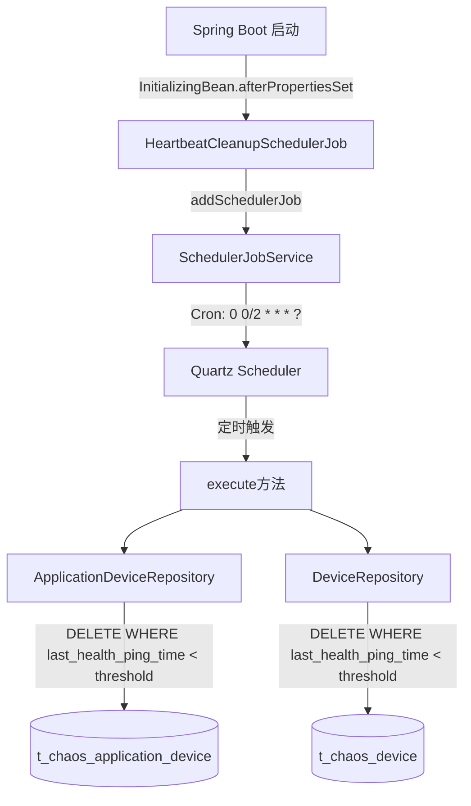
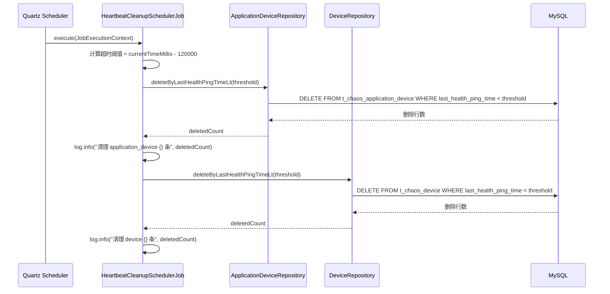

# 技术设计文档：心跳清理定时任务（Heartbeat Cleanup Scheduler）

## 概述

本设计为 ChaosBlade Box 平台新增一个 Quartz 定时任务 `HeartbeatCleanupSchedulerJob`，每 2 分钟执行一次，物理删除 `t_chaos_application_device` 和 `t_chaos_device` 两张表中 `last_health_ping_time` 超过 2 分钟的设备记录。

设计完全遵循项目现有的定时任务模式（参考 `ExperimentTaskAutoRecoverySchedulerJob`），继承 `BaseJob`，实现 `Job` 和 `InitializingBean` 接口，通过 `SchedulerJobService` 在 Spring 启动后自动注册。

## 架构

### 系统架构图



### 组件交互流程



## 组件与接口

### 1. HeartbeatCleanupSchedulerJob

新增定时任务类，位于 `chaosblade-box-dao` 模块的 `com.alibaba.chaosblade.box.dao.scheduler.job` 包下。


```java
package com.alibaba.chaosblade.box.dao.scheduler.job;

@Component
@Slf4j
@DisallowConcurrentExecution
public class HeartbeatCleanupSchedulerJob extends BaseJob implements Job, InitializingBean {

    private static final long HEARTBEAT_TIMEOUT_MS = 2 * 60 * 1000; // 2分钟

    @Autowired
    private ApplicationDeviceRepository applicationDeviceRepository;

    @Autowired
    private DeviceRepository deviceRepository;

    @Autowired
    private SchedulerJobService schedulerJobService;

    @Override
    public void execute(JobExecutionContext context) throws JobExecutionException {
        long threshold = System.currentTimeMillis() - HEARTBEAT_TIMEOUT_MS;
        // 清理 t_chaos_application_device
        try {
            int appDeviceDeleted = applicationDeviceRepository.deleteByLastHealthPingTimeLt(threshold);
            log.info("heartbeat cleanup: deleted {} records from t_chaos_application_device", appDeviceDeleted);
        } catch (Exception e) {
            log.error("heartbeat cleanup: failed to delete from t_chaos_application_device", e);
        }
        // 清理 t_chaos_device
        try {
            int deviceDeleted = deviceRepository.deleteByLastHealthPingTimeLt(threshold);
            log.info("heartbeat cleanup: deleted {} records from t_chaos_device", deviceDeleted);
        } catch (Exception e) {
            log.error("heartbeat cleanup: failed to delete from t_chaos_device", e);
        }
    }

    @Override
    public void afterPropertiesSet() throws Exception {
        String cronExpression = "0 0/2 * * * ?";
        SchedulerJobCreateRequest request = new SchedulerJobCreateRequest(
            cronExpression,
            0,
            HeartbeatCleanupSchedulerJob.class.getName(),
            SchedulerConstant.BUSINESS_TYPE_HEARTBEAT_CLEANUP,
            "-1",
            HeartbeatCleanupSchedulerJob.class.getName()
        );
        schedulerJobService.addSchedulerJob(request);
    }
}
```

设计决策：
- 使用 `@DisallowConcurrentExecution` 防止并发执行，与 `ExperimentTaskAutoRecoverySchedulerJob` 保持一致
- 两张表的清理操作分别用 try-catch 包裹，一张表失败不影响另一张表的清理
- 超时阈值使用 `System.currentTimeMillis() - 120000`，与现有 `setStatusOffLineWhenHealthTimeIntervalGt` 方法的计算方式一致

### 2. SchedulerConstant 新增常量

在 `SchedulerConstant` 中新增业务类型常量：

```java
public static Integer BUSINESS_TYPE_HEARTBEAT_CLEANUP = 80;
```

选择 80 是因为现有最大值为 70（`BUSINESS_TYPE_APPLICATION_CHANGE_DISABLED_TRUE`）。

### 3. ApplicationDeviceRepository 新增方法

```java
public int deleteByLastHealthPingTimeLt(Long threshold) {
    QueryWrapper<ApplicationDeviceDO> queryWrapper = new QueryWrapper<>();
    queryWrapper.lt("last_health_ping_time", threshold);
    return applicationDeviceMapper.delete(queryWrapper);
}
```

设计决策：
- 直接使用 MyBatis-Plus 的 `delete` 方法进行物理删除，不做软删除
- 使用 `lt`（小于）条件匹配 `last_health_ping_time < threshold`
- 不限制 `status` 条件，因为无论在线还是离线，只要心跳超时就应该清理

### 4. DeviceRepository 新增方法

```java
public int deleteByLastHealthPingTimeLt(Long threshold) {
    QueryWrapper<DeviceDO> queryWrapper = new QueryWrapper<>();
    queryWrapper.lt("last_health_ping_time", threshold);
    return deviceMapper.delete(queryWrapper);
}
```

与 `ApplicationDeviceRepository` 的实现保持一致。

## 数据模型

### t_chaos_application_device 表

| 字段 | 类型 | 说明 |
|------|------|------|
| id | BIGINT | 主键 |
| last_health_ping_time | BIGINT | 最后心跳时间（毫秒时间戳） |
| status | INT | 设备状态：ONLINE(2), OFFLINE(3) |
| app_name | VARCHAR | 应用名称 |
| configuration_id | VARCHAR | 设备配置ID |
| private_ip | VARCHAR | 内网IP |
| gmt_create | DATETIME | 创建时间 |
| gmt_modified | DATETIME | 修改时间 |

对应实体：`ApplicationDeviceDO` → `ChaosApplicationDeviceDO` → `BaseDO`

### t_chaos_device 表

| 字段 | 类型 | 说明 |
|------|------|------|
| id | BIGINT | 主键 |
| last_health_ping_time | BIGINT | 最后心跳时间（毫秒时间戳） |
| status | INT | 设备状态：ONLINE(2), OFFLINE(3) |
| device_name | VARCHAR | 设备名称 |
| configuration_id | VARCHAR | 设备配置ID |
| private_ip | VARCHAR | 内网IP |
| cluster_id | VARCHAR | 集群ID |
| gmt_create | DATETIME | 创建时间 |
| gmt_modified | DATETIME | 修改时间 |

对应实体：`DeviceDO` → `base.DeviceDO` → `BaseDO`

### 清理逻辑的 SQL 等价

```sql
-- 清理 t_chaos_application_device
DELETE FROM t_chaos_application_device
WHERE last_health_ping_time < (UNIX_TIMESTAMP() * 1000 - 120000);

-- 清理 t_chaos_device
DELETE FROM t_chaos_device
WHERE last_health_ping_time < (UNIX_TIMESTAMP() * 1000 - 120000);
```


## 正确性属性（Correctness Properties）

*属性是在系统所有有效执行中都应成立的特征或行为——本质上是关于系统应该做什么的形式化陈述。属性是人类可读规范与机器可验证正确性保证之间的桥梁。*

### Property 1: 清理后不变量（超时记录全部删除）

*对于任意*设备记录集合和任意超时阈值 threshold，执行 `deleteByLastHealthPingTimeLt(threshold)` 后，表中不应存在 `last_health_ping_time < threshold` 的记录。

**Validates: Requirements 1.1, 1.2, 2.1, 2.2**

### Property 2: 清理保留性（未超时记录不受影响）

*对于任意*设备记录集合和任意超时阈值 threshold，执行 `deleteByLastHealthPingTimeLt(threshold)` 后，所有 `last_health_ping_time >= threshold` 的记录应仍然存在且数据不变。

**Validates: Requirements 1.1, 1.2, 2.1, 2.2**

### Property 3: 异常隔离性（一张表失败不影响另一张表）

*对于任意*执行场景，如果 `ApplicationDeviceRepository.deleteByLastHealthPingTimeLt` 抛出异常，`DeviceRepository.deleteByLastHealthPingTimeLt` 仍应正常执行（反之亦然），且 `execute` 方法不应抛出异常。

**Validates: Requirements 1.4, 2.4**

## 错误处理

| 错误场景 | 处理方式 |
|----------|----------|
| ApplicationDeviceRepository 删除时数据库异常 | catch Exception，记录 error 日志，继续执行 DeviceRepository 的清理 |
| DeviceRepository 删除时数据库异常 | catch Exception，记录 error 日志，execute 方法正常返回 |
| SchedulerJobService 注册失败 | 由 Spring 启动流程处理，启动失败会在日志中体现 |
| last_health_ping_time 为 null 的记录 | MyBatis-Plus 的 `lt` 条件会自动排除 null 值，这些记录不会被删除 |

## 测试策略

### 属性测试（Property-Based Testing）

使用 **jqwik**（Java 属性测试库）实现属性测试，每个属性测试至少运行 100 次迭代。

每个属性测试必须用注释标注对应的设计属性：
- 格式：`Feature: heartbeat-cleanup-scheduler, Property {number}: {property_text}`

属性测试覆盖：
- Property 1 & 2：生成随机的设备记录集合（包含不同的 `lastHealthPingTime` 值），插入数据库，执行删除方法，验证删除后的不变量和保留性
- Property 3：mock Repository 使其抛出异常，验证 execute 方法不抛出异常且另一个 Repository 的方法仍被调用

### 单元测试

单元测试覆盖具体示例和边界情况：
- 验证 `afterPropertiesSet` 调用 `schedulerJobService.addSchedulerJob` 且 cron 表达式为 `0 0/2 * * * ?`（验收标准 3.1, 3.2）
- 验证 `HeartbeatCleanupSchedulerJob` 类上存在 `@DisallowConcurrentExecution` 注解（验收标准 3.4）
- 验证删除操作完成后日志包含删除数量（验收标准 1.3, 2.3）
- 验证空表场景下 execute 正常执行且日志记录删除 0 条

### 测试配置

```xml
<!-- pom.xml 中添加 jqwik 依赖 -->
<dependency>
    <groupId>net.jqwik</groupId>
    <artifactId>jqwik</artifactId>
    <version>1.8.2</version>
    <scope>test</scope>
</dependency>
```

## 构建与部署方案

### 构建步骤

```bash
# 1. Maven 编译（跳过测试）
mvn clean package -Dmaven.test.skip=true

# 2. 构建 ARM64 Docker 镜像（Rancher Desktop 环境下自动构建 ARM64）
make docker-build

# 或手动指定版本
docker build \
  --build-arg VERSION=1.1.0 \
  --build-arg JAR_FILE=chaosblade-box-1.1.0.jar \
  -t chaosblade-box:1.1.0 \
  -f Dockerfile .
```

### K8s 部署

```bash
# 使用 Rancher Desktop 内置的 K8s 集群
# 镜像已在本地构建，K8s 可直接使用

# 方式一：使用 Helm
make helm-package
helm upgrade --install chaosblade-box ./dist/chaosblade-box-1.1.0.tgz

# 方式二：直接更新 Deployment 镜像
kubectl set image deployment/chaosblade-box \
  chaosblade-box=chaosblade-box:1.1.0

# 验证部署
kubectl get pods -l app=chaosblade-box
kubectl logs -f <pod-name> | grep "heartbeat cleanup"
```

### 验证清理功能

```bash
# 查看日志确认定时任务执行
kubectl logs -f <pod-name> | grep "heartbeat cleanup"

# 预期输出（每2分钟一次）：
# heartbeat cleanup: deleted X records from t_chaos_application_device
# heartbeat cleanup: deleted Y records from t_chaos_device
```
